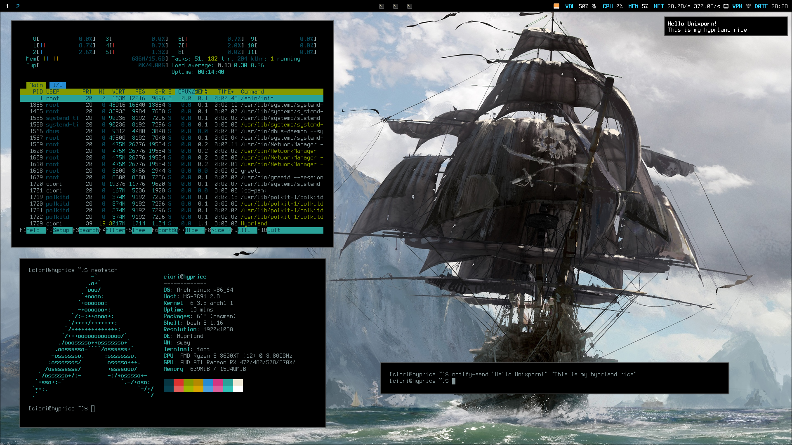

# Hyprice

Hyprland rice configuration files

This is a very specific setup for which you probably want to change something, read the **Read Before Use** section first, then look at the **TODO** list to see what this script doesn't do yet.

For now this is pretty much a "run and forget" script to just speed up my setup on a new machine.

## Read Before Use

There are some requirements/limitations:
- **This is created for an AMD Graphics Card equipped system**. The setup will install the package `libva-mesa-driver` used for `wf-recorder`. In case you use something else, look for Hardware/Video Acceleration (VA-API) in the Arch Wiki and change that packet accordingly.
- **This rice is for a Desktop PC with Ethernet connection and no Bluetooth or WiFi**. The interface lacks all the useful widgets and shortcuts for bluetooth, wifi and battery and has no power management tools. They will probably be added in the future.
- **This rice has specific display settings**, therefore you should change those settings before rebooting into the new environment.
- **This rice containes some specific applications with hyprland shortcuts or other options**, so change those to your linkings.
- **I might be forgetting something, you have ben warned :)**

## Features

General overview of the rice:



All the functionalities and actions are pretty much found inside the hyprland, autostart and waybar configs.

Some shortcut actions:
- Foot terminal: `Super + Enter` (use also `Shift` for a floating window)
- Browser (Librewolf): `Super + B` (use `T` instead for the Tor Browser)
- Thunar: `Super + E`
- Codium: `Super + C`
- Mousepad text editor: `Super + M`
- KeePassXC: `Super + K` (You should use a password manager)
- Lock the screen with `Super + L`
- Navigate to next/previous workspace (all monitors) with `Ctrl + Alt + <right/left arrow>`
- Power menu (bemenu) with `Super + ESC`. You can poweroff, reboot, lock or logout (you won't find suspend or hybernate options, I hate them).
- Screen capture menu (bemenu) with `Super + S`. You can screenshot all the monitors or a portions of a screen, then you can even edit the screenshot with swappy.

Some waybar configurations:
- Audio:
  - clicking on the widget will open `pavucontrol`
  - right clicking will mute the current output device
  - middle mouse clicking will mute the current input device
  - scrolling the mouse wheel on the widget or using the dedicated volume keys on the keyboard will increase or decrease the current volume level, with a nice visual bar feedback thanks to `wob`.
- System Monitoring:
  - clicking on the cpu or memory widget will open `htop` with the proper column selected.
- Network:
  - clicking on the widget will open `nm-connection-editor`
  - right clicking on the widget will open a terminal with the output from `nmcli connection show`
  - If you use VPNs, it is recommended to add/import them with the `nmcli` command line so that they are manageble with `nm-connection-editor`
- Clock:
  - clicking on the widget will display the date instead
  - right clicking on the widget will open thunderbird

## Installation

Steps:
- start from a fresh installation of archlinux:
  - use the [archinstall](https://github.com/archlinux/archinstall) tool
  - select a minimal profile
  - select networkmanager
  - create a sudo user (non root)
  - add `git` as an additional package
- boot into the new system and login as your non root user
- run the script:
  ```
  git clone https://github.com/ciori/hyprice.git
  cd hyprice
  chmod +x hyprice.sh
  ./hyprice.sh
  ```
- the process is interactive, so answer the questions accordingly:
  - watch out for package choices
  - use wayland version of packages if asked
- before restarting the pc:
  - change all the monitor/display settings to your likings inside:
    - hyprland config
    - waybar config
    - bemenu scripts
  - change your keyboard layout inside hyprland config
- restart the pc
- what to configure after:
  - audio devices in pavucontrol
  - wireguard or other vpn in waybar config (interface) if you use them
  - maybe add a sync client (nextcloud) and/or configure thunderbird 

## TODO

Things to add or change:
- [ ] centralize/improve theme/palette management and colors
- [ ] improve right clicking on network widget
- [ ] remove every command interaction in the setup script.
- [ ] add laptop support for wifi, bluetooth, battery and power management.
- [ ] other apps configuration, like mpv
- [ ] rework the setup so that dotfiles can be easily updated/versioned in the repo